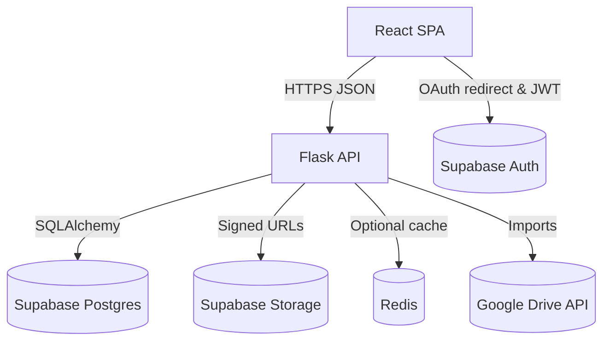
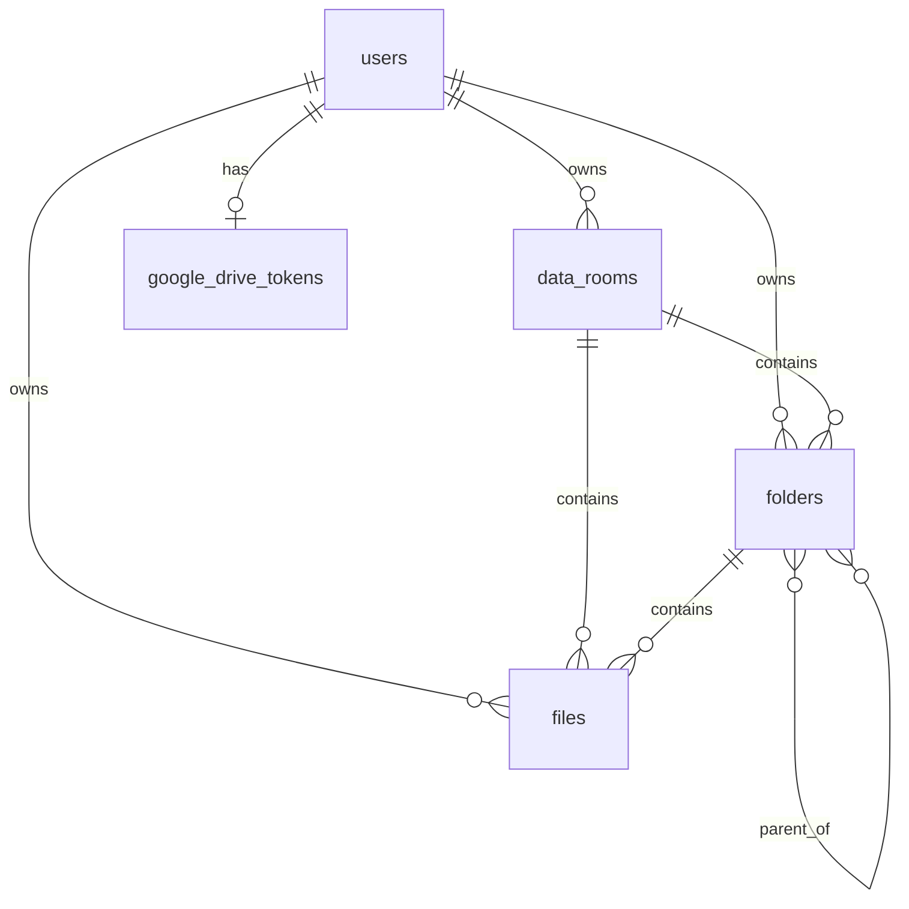

# Architecture

## 1. System Overview
Data Room is a secure document workspace delivered as a monorepo. The repository contains:

- `frontend/`: a React single-page application responsible for the end-user experience.
- `backend/`: a Flask API that exposes authenticated REST endpoints, talks to Supabase Postgres, and manages file storage.
- `old_backend/`: the legacy Node/Prisma stack kept for database schema tooling and historical context.

Supabase provides authentication, PostgreSQL storage, and object storage. Optional integrations include Redis for caching and the Google Drive API for imports.

### High-Level Data Flow

## 2. Subsystem Map

| Area | Path | Highlights |
| --- | --- | --- |
| Frontend SPA | `frontend/src` | CRA + CRACO, React 19 SPA with TanStack Query, Tailwind, Radix UI |
| Flask API | `backend/` | Flask 3 app with SQLAlchemy models, Supabase integration, Google Drive service |
| Legacy tooling | `old_backend/` | Node/Prisma schema & scripts kept for DB migrations and introspection |
| Shared scripts | Repository root | npm scripts (`npm run dev`, Prisma helpers), documentation |

## 3. Frontend

### 3.1 Composition & Bootstrapping
- The SPA is bootstrapped with Create React App and customized through `frontend/craco.config.js`, which adds the `@` alias and exposes `PYTHON_API_URL` without a `REACT_APP_` prefix.
- `frontend/src/index.tsx` renders `App` into the DOM. `App.tsx` configures the global `QueryClient`, wraps the tree with `AuthProvider`, and sets up `React Router` with lazy-loaded routes and a shared `Layout`.

### 3.2 Routing & Layout
- Routing is handled by React Router v7. `PrivateRoute` guards authenticated paths and mounts `Layout`, which hosts the header, navigation, toasts, and an `Outlet`.
- Lazy pages (`Login`, `DataRoomRoot`, `FolderView`) provide code splitting and suspense fallbacks.

### 3.3 Data Fetching & State
- Server state is managed via TanStack Query 5 with conservative defaults (`staleTime` 60s, `gcTime` 5–10 minutes). Keys follow the `['dataRoom', id]` pattern.
- Custom hooks such as `useDataRoomData`, `useDataRoomMutations`, `useFileUpload`, and `useGoogleDriveFiles` centralize queries, cache invalidation, and optimistic UX.
- Client-side timing helpers (`performance.mark`) record fetch durations during development for introspection.

### 3.4 Authentication & API Client
- `frontend/src/contexts/AuthContext.tsx` wraps the tree, retrieves the Supabase session, and writes the access token to the axios client via `setAuthToken`.
- Supabase client (`frontend/src/lib/supabase.ts`) handles Google OAuth sign-in/out. Token changes trigger refetches of `/api/auth/me`.
- `frontend/src/lib/api.ts` defines an axios instance pointed at `PYTHON_API_URL`, adds the `Authorization` header, and normalizes error handling with toast feedback.

### 3.5 UI Layer
- UI primitives live in `frontend/src/components/ui` (shadcn-style wrappers around Radix primitives). Higher-level modules (`DataRoomView`, `Dialogs`, `GoogleDrive`, `FileTree`) compose the workspace experience.
- Preview components (`PDFPreview`, `ImagePreview`, `OfficePreview`) handle file rendering with fallbacks to icons.
- `frontend/src/lib/events.ts` exposes an EventEmitter3 instance used for decoupled updates inside the file tree.

### 3.6 File & Drive Workflows
- Upload dialogs use a two-phase flow: request a signed upload URL (`/files/upload-url`), post the file directly to Supabase Storage, then call `/files/upload-complete`.
- Rename/move/delete hooks invalidate affected query keys to keep data views fresh.
- Google Drive components orchestrate sign-in state, listing, and import operations around the backend service.

### 3.7 Testing & Tooling
- Jest + React Testing Library are configured via `frontend/package.json` and `frontend/setupTests.ts`.
- The `/__tests__/` directory contains integration tests; mocks under `/__mocks__/` stub API replies.
- Tailwind styling lives in `frontend/src/index.css` with component-level class merges via `tailwind-merge`.

### 3.8 Configuration
- Runtime configuration derives from `frontend/env.example`. CRA automatically injects `REACT_APP_*` variables; CRACO exposes `PYTHON_API_URL`.
- The app expects the backend to be reachable at `/api`, so local `.env.local` typically sets `PYTHON_API_URL=http://localhost:3001/api`.

## 4. Backend

### 4.1 Application Startup
- `backend/app.py` exports `create_app()`, loads environment variables, and configures Flask with settings from `Config`.
- SQLAlchemy is initialized with pooled connections. A warm-up query runs at startup to prime the Supabase connection.
- CORS is configured with specific origins and preflight caching (`max_age=600`). A `before_request` hook timestamps API requests for performance logs; `teardown_appcontext` returns sessions to the pool.
- Blueprints register under `/api/auth`, `/api/data-rooms`, `/api/folders`, `/api/files`, and `/api/google-drive`. Health probes are exposed at `/api/health` and `/`.

### 4.2 Authentication Middleware
- `middleware/auth.py` verifies Supabase JWTs locally via `utils/jwt_verifier.py` and falls back to `supabase.auth.get_user` on signature mismatch.
- A short-lived in-memory cache (`utils/user_cache.py`) stores Supabase UID → internal user ID mappings to avoid repeated lookups.
- New Supabase users are persisted to Postgres on first request, along with a default data room.

### 4.3 Database Layer
- ORM models in `backend/models.py` define tables `users`, `data_rooms`, `folders`, `files`, and `google_drive_tokens`, each using UUID primary keys.
- Composite functional indexes (`idx_folder_unique`, `idx_file_unique`) enforce case-insensitive uniqueness within a folder or data room.
- `Config` tunes pool size, timeouts, and statement limits differently for Supabase session (5432) versus transaction (6543) ports and validates required environment variables at import time.

### 4.4 Caching
- `utils/cache.py` implements a cache manager that prefers Redis (via `REDIS_URL`) and gracefully falls back to an in-memory store. It supports tag-based invalidation for related entities.
- Helper functions (`get_cache_key`, `invalidate_cache`) centralize key formats. Cache toggling is controlled through `CACHE_ENABLED` and `CACHE_TTL`.

### 4.5 File Storage
- `utils/supabase_storage.py` wraps Supabase Storage: generating signed upload URLs, uploading buffers, creating signed download URLs, and deleting objects.
- File routes support both modern direct-upload (`/files/upload-url`, `/files/upload-complete`) and legacy multipart uploads (`/files/upload`), enforce 4.5 MB size limits, validate MIME types, and asynchronously delete storage objects after database removal.

### 4.6 Google Drive Integration
- `services/google_drive_service.py` encapsulates the OAuth flow, token refresh, file listing, exporting Google Workspace documents, and disconnect logic.
- The service uses `GoogleDriveToken` records for persistence and refreshes tokens when they are within five minutes of expiry.
- Route handlers in `routes/google_drive_routes.py` orchestrate auth URLs, callback handling (with scope validation), status, disconnect, and import endpoints.

### 4.7 Validation & Error Handling
- Marshmallow schemas validate payloads for endpoints such as `create_data_room`.
- `middleware/error_handler.py` standardizes API responses, maps database constraint violations to human-friendly messages, and downgrades operational errors to `503` to signal retryable issues.
- Utility modules (`file_validation.py`, `conflict_checker.py`) consolidate whitelist logic and conflict detection to avoid duplication.

### 4.8 Observability & Performance
- `utils/performance_monitor.py` attaches SQLAlchemy event listeners to time each query and aggregate metrics; request handlers log totals when `g.log_request_timing` is set.
- Authentication middleware logs per-stage timing in development. Console logs surface slow queries and cache failures without breaking requests.

### 4.9 Background Operations
- File deletion from Supabase Storage runs inside a detached thread to keep API responses responsive. Future improvements could replace this with a task queue.

## 5. Data Model

| Table | Purpose | Notable fields & constraints |
| --- | --- | --- |
| `users` | Authenticated account records | `email` and `supabase_uid` unique indexes; default data room created for new users |
| `data_rooms` | Top-level workspace per user | Unique `(user_id, name)` constraint; cascades delete child folders/files |
| `folders` | Hierarchical containers | Functional unique index on `data_room_id`, `parent_folder_id`, `lower(name)`; self-referential relationship for tree |
| `files` | Uploaded or imported files | Functional unique index mirroring folders; stores Supabase storage `file_path`, size, mime type |
| `google_drive_tokens` | OAuth credentials | One-to-one with `users`; stores access/refresh tokens and expiry |

### Entity Relationships

## 6. Key Application Flows

### 6.1 Authentication Handshake
1. Browser triggers Supabase Google OAuth via `AuthContext`. Supabase stores the session in local storage.
2. After redirect, `AuthContext` obtains the access token, writes it into `lib/api.ts`, and calls `/api/auth/me`.
3. `authenticate_token` verifies the JWT, reads (or creates) the `User` record, seeds default data, and attaches `g.user` for downstream handlers.

### 6.2 Data Room & Folder Retrieval
1. `useDataRoomData` issues `GET /api/data-rooms/:id` or `GET /api/folders/:id/contents` with `fields` filters to trim payloads.
2. The backend assembles folder/file lists with aggregate counts using pre-joined subqueries to avoid N+1 queries.
3. TanStack Query caches responses, while helper hooks request `allFolders`/`allFiles` lazily for search and navigation.

### 6.3 Supabase Direct Upload
1. User selects a file; frontend validates type/size and calls `/api/files/upload-url`.
2. Backend verifies data room ownership, validates MIME type, and returns a signed PUT URL plus a canonical storage path.
3. Frontend uploads the file directly to Supabase Storage, then posts metadata to `/api/files/upload-complete`.
4. Backend persists the `File` record, enforcing unique-name constraints, and returns the object for cache hydration.

### 6.4 Google Drive Import
1. User connects Drive via `/api/google-drive/auth` → Google OAuth. Tokens are stored in `google_drive_tokens`.
2. Listing uses `/api/google-drive/files`, which filters to whitelisted MIME types.
3. Import downloads the document (exporting Google Workspace files when necessary), validates conflicts, uploads to Supabase Storage, and creates a `File` entry.
4. Errors for individual files are collected so the frontend can display granular status.

## 7. Operational Considerations

- **Security:** HTTPS enforced at the edge, strict CORS configuration, Google OAuth state includes the internal user ID, and file uploads validate type, size, and location conflicts.
- **Configuration:** `backend/env.example` and `frontend/env.example` enumerate required variables. `Config.validate()` fails fast during startup when critical secrets are absent.
- **Caching:** Toggleable Redis cache provides tag-based invalidation; safe fallbacks ensure functionality when Redis is unreachable.
- **Scalability:** Supabase-managed Postgres handles storage; connection pooling settings are tuned for free-tier limits. Serverless-friendly patterns (stateless handlers, async storage deletion) keep horizontal scaling straightforward.
- **Observability:** Console logs surface slow queries and cache metrics in development. Health endpoints simplify platform probes.

## 8. Legacy Node / Prisma Backend

The `old_backend/` directory preserves the previous Node/Express implementation and Prisma schema. It remains useful for:
- Generating Prisma migrations or clients (`npm run db:generate`, `npm run db:migrate`, `npm run db:push`).
- Inspecting the schema with Prisma Studio (`npm run db:studio`).
- Providing historical reference while the Python backend matures.

New features and runtime traffic live exclusively in the Flask service; the legacy code should only be invoked for schema tooling or data migrations.
