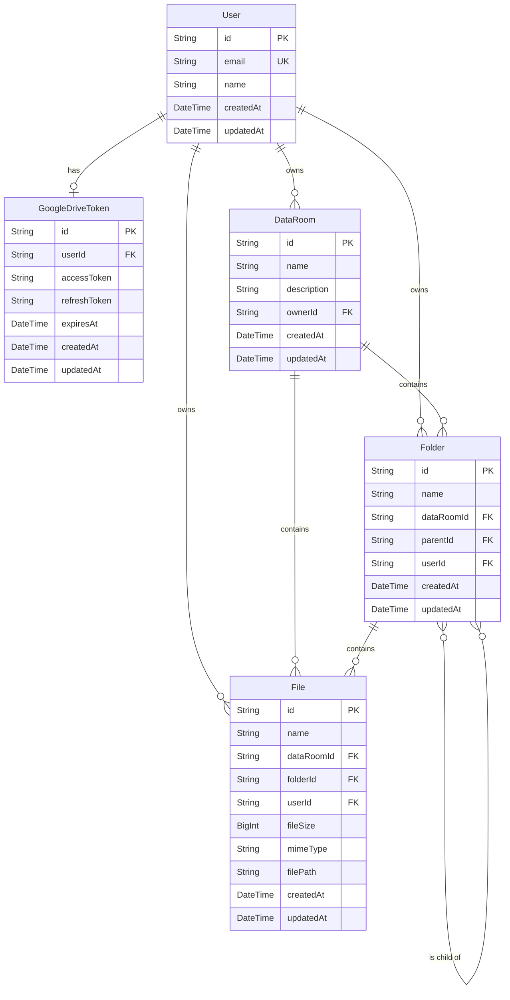

# System Architecture Document

This document provides a detailed overview of the technical architecture of the Data Room application.

## 1. High-Level Architecture

The application follows a **client-server model** with a modern web stack. It is structured as a **monorepo** containing two main projects:

-   `frontend`: A Single Page Application (SPA) built with React.
-   `backend`: A RESTful API built with Node.js and Express.

This structure simplifies development, dependency management, and deployment.

### Core Technologies

-   **Frontend**: React 19, TypeScript, React Router v7, TanStack Query, Tailwind CSS
-   **Backend**: Node.js, Express, TypeScript, Prisma
-   **Database**: Supabase (PostgreSQL)
-   **Deployment**: Vercel

---

## 2. Frontend Architecture

The frontend is a modern, performant, and maintainable React application.

### 2.1. Core Framework & Language

-   **React**: The UI is built using React for its component-based architecture and declarative nature.
-   **TypeScript**: We use TypeScript for static typing, which improves code quality, developer experience, and reduces runtime errors.
-   **Create React App (CRA) with Craco**: The project is bootstrapped with CRA and customized using `Craco` to allow for configuration overrides (like Tailwind CSS) without ejecting.

### 2.2. Routing

-   **React Router DOM (`v7`)**: Handles all client-side routing. The application uses a centralized routing setup in `App.tsx` which includes:
    -   Public and private routes.
    -   Lazy loading of pages/components using `React.lazy` and `Suspense` for better initial load performance.
    -   A `PrivateRoute` component to protect routes that require authentication.

### 2.3. State Management & Data Fetching

-   **TanStack Query (React Query v5)**: Used as the primary tool for server state management. It handles data fetching, caching, synchronization, and updates with excellent developer experience.
    -   **Caching Strategy**: A default caching strategy is configured in `App.tsx` with a `staleTime` of 1 minute and a `gcTime` (garbage collection time, formerly `cacheTime`) of 5 minutes.
-   **React Context API**: Used for global UI state, specifically for authentication (`AuthContext`). It provides user and session information to all components in the application.
-   **Axios**: The HTTP client used to make requests to the backend API.

### 2.4. UI & Styling

-   **Tailwind CSS**: A utility-first CSS framework for rapid UI development.
-   **Radix UI**: Provides unstyled, accessible UI primitives which are used as a base for custom components. This is indicative of a `shadcn/ui`-like setup.
-   **Component Library**: The UI is built with a custom component library located in `src/components/ui`, ensuring a consistent look and feel across the application.
-   **lucide-react**: Used for icons.

### 2.5. Folder Structure

The `frontend/src` directory is organized as follows:

```
/src
├── /components       # Reusable UI components
│   ├── /ui           # Base UI components (Button, Card, Dialog, etc.)
│   ├── /DataRoomView # Data room specific components
│   ├── /Dialogs      # Dialog components (CreateFolder, UploadFile, Rename)
│   ├── /GoogleDrive  # Google Drive integration components
│   ├── DataTable.tsx # Table component for list view
│   ├── Layout.tsx    # Main layout component
│   ├── PrivateRoute.tsx # Route protection component
│   ├── PDFPreview.tsx # PDF preview component
│   └── ImagePreview.tsx # Image preview component
├── /contexts         # React Context providers (e.g., AuthContext)
├── /hooks            # Custom React hooks
│   ├── useDataRoomData.ts
│   ├── useFileUpload.ts
│   ├── useGoogleDrive.ts
│   └── ...
├── /lib              # API utilities and shared logic
│   ├── /api          # API client configuration
│   ├── /events       # Event system for component communication
│   └── utils.ts      # Utility functions
├── /pages            # Top-level page components (lazily loaded)
│   ├── Login.tsx
│   ├── DataRooms.tsx
│   ├── DataRoomRoot.tsx
│   └── FolderView.tsx
├── /types            # TypeScript type definitions
├── /utils            # Utility functions
│   ├── fileValidation.ts # File type validation utilities
│   └── fileIcons.ts      # File icon utilities
├── App.tsx           # Root component with routing setup
└── index.tsx         # Application entry point
```

---

## 3. Backend Architecture

The backend is a robust and scalable Node.js application built with Express.

### 3.1. Core Framework & Language

-   **Node.js**: The runtime environment.
-   **Express.js**: A minimal and flexible web application framework for Node.js. It's used to define the REST API routes and middleware.
-   **TypeScript**: Ensures type safety and better code organization.

### 3.2. API Design

-   **RESTful API**: The backend exposes a RESTful API for the frontend to consume.
-   **Routing**: Routes are modularized and located in the `src/routes` directory (e.g., `auth.ts`, `dataRooms.ts`, `folders.ts`, `files.ts`, `googleDrive.ts`). Route handlers contain the business logic directly within route files.
-   **Middleware**: The application makes extensive use of Express middleware for:
    -   **Security**: `helmet` for setting various HTTP headers, `cors` for Cross-Origin Resource Sharing, `express-rate-limit` to prevent brute-force attacks.
    -   **Authentication**: A custom `authenticateToken` middleware to protect routes.
    -   **Logging**: `morgan` for HTTP request logging.
    -   **Error Handling**: A centralized `errorHandler` middleware with `asyncHandler` wrapper for async route handlers.
    -   **File Uploads**: `multer` is used for handling multipart/form-data, primarily for file uploads.
    -   **Validation**: `express-validator` for input validation and sanitization.

### 3.3. Database & ORM

-   **Supabase (PostgreSQL)**: The primary database. Supabase provides a managed PostgreSQL instance with additional features like authentication and storage.
-   **Prisma**: A next-generation ORM for Node.js and TypeScript.
    -   **Schema Definition**: The database schema is defined in `prisma/schema.prisma`.
    -   **Type Safety**: Prisma Client is auto-generated from the schema, providing fully type-safe database queries.
    -   **Migrations**: Prisma Migrate is used for declarative database schema migrations.

### 3.4. Folder Structure

The `backend/src` directory is organized as follows:

```
/src
├── /config           # Environment configuration
│   └── index.ts      # Centralized config with validation
├── /lib              # Shared libraries
│   └── prisma.ts     # Prisma client instance
├── /middleware       # Express middleware
│   ├── auth.ts       # Authentication middleware
│   └── errorHandler.ts # Error handling middleware
├── /routes           # API route definitions
│   ├── auth.ts       # Authentication routes
│   ├── dataRooms.ts  # Data room CRUD operations
│   ├── folders.ts    # Folder CRUD operations
│   ├── files.ts      # File CRUD operations
│   └── googleDrive.ts # Google Drive integration routes
├── /services         # Business logic services
│   └── googleDrive.ts # Google Drive API service
├── /types            # TypeScript type definitions
├── /utils            # Utility functions
│   ├── fileValidation.ts # File type validation utilities
│   ├── conflictChecker.ts # Name conflict checking utilities
│   └── supabase.ts   # Supabase storage utilities
└── index.ts          # Application entry point, server and middleware setup
```

### 3.5. API Routes

The backend exposes the following API endpoints:

**Authentication:**
-   `GET /api/auth/me` - Get current user profile

**Data Rooms:**
-   `GET /api/data-rooms` - List all data rooms for authenticated user
-   `POST /api/data-rooms` - Create a new data room
-   `GET /api/data-rooms/:id` - Get a specific data room
-   `PUT /api/data-rooms/:id` - Update a data room
-   `DELETE /api/data-rooms/:id` - Delete a data room

**Folders:**
-   `GET /api/folders` - List folders (filtered by dataRoomId)
-   `GET /api/folders/:id/contents` - Get folder contents (children and files)
-   `GET /api/folders/:id/tree` - Get folder breadcrumb tree
-   `POST /api/folders` - Create a new folder
-   `PATCH /api/folders/:id/rename` - Rename a folder
-   `PATCH /api/folders/:id/move` - Move a folder
-   `DELETE /api/folders/:id` - Delete a folder

**Files:**
-   `GET /api/files` - List files (filtered by dataRoomId or folderId)
-   `GET /api/files/:id/view` - Get signed URL for file viewing
-   `POST /api/files/upload` - Upload a new file
-   `PUT /api/files/:id` - Update file metadata (rename)
-   `DELETE /api/files/:id` - Delete a file

**Google Drive:**
-   `GET /api/google-drive/auth` - Get Google OAuth URL
-   `GET /api/google-drive/callback` - OAuth callback handler
-   `GET /api/google-drive/status` - Check connection status
-   `DELETE /api/google-drive/disconnect` - Disconnect Google Drive
-   `GET /api/google-drive/files` - List files from Google Drive
-   `POST /api/google-drive/import` - Import single file from Google Drive
-   `POST /api/google-drive/import-multiple` - Import multiple files from Google Drive

---

## 4. Authentication

-   **Supabase Auth**: Authentication is handled by Supabase. The frontend interacts directly with Supabase for user sign-up, sign-in (Google OAuth), and session management.
-   **JWT (JSON Web Tokens)**: Supabase issues JWTs to authenticated users. The frontend stores this token and sends it in the `Authorization` header of every request to the backend.
-   **Backend Token Validation**: The `authenticateToken` middleware on the backend verifies the JWT signature with Supabase's public key to authorize requests.

---

## 5. Google Drive Integration

The application includes comprehensive Google Drive integration for importing files directly from a user's Google Drive account.

### 5.1. Architecture

-   **OAuth 2.0 Flow**: Uses Google OAuth 2.0 for secure authentication
-   **Token Management**: Access tokens and refresh tokens are stored in the `GoogleDriveToken` table
-   **Service Layer**: `GoogleDriveService` handles all Google Drive API interactions
-   **Automatic Token Refresh**: Tokens are automatically refreshed when they expire (within 5 minutes of expiry)

### 5.2. Integration Flow

1. **Connection**: User initiates connection from frontend
2. **OAuth Authorization**: User is redirected to Google for authorization
3. **Callback Handling**: Backend receives authorization code and exchanges for tokens
4. **Token Storage**: Tokens are stored securely in database
5. **File Listing**: Frontend fetches files from Google Drive (filtered by allowed types)
6. **File Import**: Selected files are downloaded, validated, and imported to data room

### 5.3. File Type Support

Only specific file types are allowed for import:
-   Images: JPG, PNG
-   Documents: PDF, DOCX, XLSX
-   Google Workspace files: Google Docs (exported as PDF), Google Sheets (exported as XLSX)

### 5.4. Security

-   Tokens are stored securely in the database
-   OAuth state parameter includes userId to prevent CSRF attacks
-   Token refresh happens automatically and transparently
-   Users can disconnect their Google Drive account at any time

---

## 6. Shared Utilities & Patterns

### 6.1. File Validation

The application uses centralized file validation utilities to ensure consistency:

-   **Location**: `backend/src/utils/fileValidation.ts` and `frontend/src/utils/fileValidation.ts`
-   **Purpose**: Validates file types (MIME types and extensions) before upload/import
-   **Benefits**: Single source of truth for allowed file types, easier maintenance

### 6.2. Conflict Checking

Name conflict checking is centralized to prevent duplicate names:

-   **Location**: `backend/src/utils/conflictChecker.ts`
-   **Purpose**: Checks for folder/file name conflicts before creation/renaming
-   **Usage**: Used across all routes that create or rename folders/files

### 6.3. Configuration Management

Centralized configuration with validation:

-   **Location**: `backend/src/config/index.ts`
-   **Purpose**: Validates required environment variables and exports configuration
-   **Benefits**: Early error detection, type-safe configuration access

---

## 7. Deployment & DevOps

-   **Vercel**: The entire application (both frontend and backend) is deployed on Vercel.
-   **Frontend Deployment**: Deployed as a static site using `@vercel/static-build`. The `frontend/vercel.json` file configures rewrites to ensure client-side routing works correctly.
-   **Backend Deployment**: Deployed as **Vercel Serverless Functions** using `@vercel/node`. Each API route becomes a serverless function.
-   **CI/CD**: Vercel provides automated builds and deployments triggered by `git push` to the main branch.
-   **Environment Variables**: Vercel's dashboard is used to manage environment variables for both frontend (`REACT_APP_*`) and backend (`DATABASE_URL`).

---

## 8. Security

Security is a critical aspect of the application. The following measures are in place:

-   **HTTPS**: Enforced by Vercel deployment.
-   **CORS (Cross-Origin Resource Sharing)**: The backend uses the `cors` middleware to restrict requests to a specific list of allowed origins (`ALLOWED_ORIGINS` env var).
-   **HTTP Security Headers**: The `helmet` middleware is used to set various security-related HTTP headers to protect against common attacks like XSS and clickjacking.
-   **Rate Limiting**: `express-rate-limit` is implemented to prevent brute-force attacks on API endpoints.
-   **Input Validation**: The `express-validator` library is used on the backend to validate and sanitize incoming request data, preventing injection attacks.
-   **File Type Validation**: All uploaded and imported files are validated against a whitelist of allowed MIME types and extensions.
-   **File Size Limits**: Maximum file size is enforced (4.5MB) to prevent resource exhaustion.
-   **Authentication**: Secure JWT-based authentication is handled by Supabase Auth. Tokens have a limited lifetime and are verified on the backend for protected routes.
-   **Secret Management**: All sensitive keys and credentials are stored as environment variables and are not hardcoded in the source code.

---

## 9. Testing Strategy

The project includes a testing strategy for both frontend and backend to ensure reliability.

### 9.1. Frontend Testing

-   **Framework**: [Jest](https://jestjs.io/) is used as the test runner.
-   **Utilities**: [React Testing Library](https://testing-library.com/docs/react-testing-library/intro/) is used for testing React components. It encourages writing tests that resemble how users interact with the application.
-   **Types of Tests**: The focus is on unit and integration tests for components and custom hooks.

### 9.2. Backend Testing

-   **Framework**: [Jest](https://jestjs.io/) is used as the test runner, with `ts-jest` for TypeScript support.
-   **Test Environment**: Tests run with a separate test database configuration (`.env.test`).
-   **Types of Tests**: The strategy includes integration tests for API routes and unit tests for individual service functions.

---

## 10. Scalability & Performance

-   **Frontend Performance**:
    -   **Code Splitting**: Page components are lazy-loaded using `React.lazy` and `Suspense`, which reduces the initial bundle size and improves load times.
    -   **Caching**: TanStack Query provides a sophisticated caching layer that minimizes unnecessary network requests.
    -   **Lazy Loading**: Images and PDFs are loaded on-demand using Intersection Observer API.
-   **Backend Scalability**:
    -   **Serverless Architecture**: The backend is deployed as Vercel Serverless Functions. This architecture scales automatically with demand, as Vercel provisions resources for each incoming request.
    -   **Database Pooling**: The use of a `DIRECT_URL` with `pgbouncer=true` in the Prisma configuration indicates that a connection pooler is used, which is essential for managing database connections efficiently in a serverless environment.
    -   **File Storage**: Files are stored in Supabase Storage, which provides scalable object storage.

---

## 11. Code Quality

-   **TypeScript**: Used across the entire stack (frontend and backend) to enforce type safety and reduce runtime errors.
-   **ESLint**: An ESLint configuration is in place to enforce a consistent code style and identify potential issues early.
-   **Monorepo**: The monorepo structure, while a high-level architectural choice, also contributes to code quality by making it easier to share types and configurations between the frontend and backend.
-   **DRY Principle**: Shared utilities are used to eliminate code duplication (file validation, conflict checking).
-   **Consistent Patterns**: Route handlers follow consistent patterns with asyncHandler wrapper and error handling.

---

## 12. Database Schema (ERD)

The following diagram illustrates the relationships between the main entities in the database.


